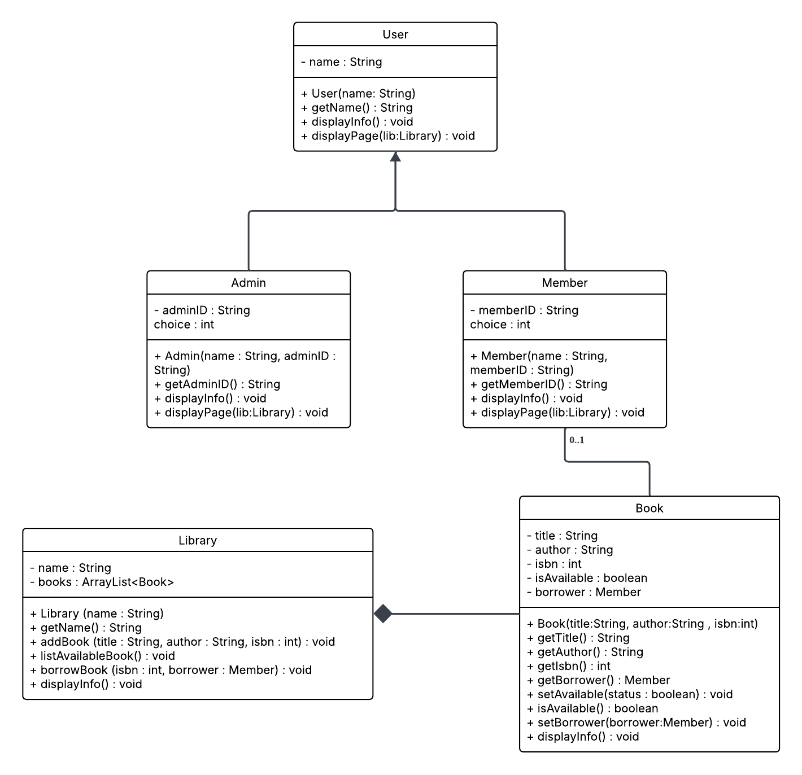
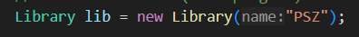
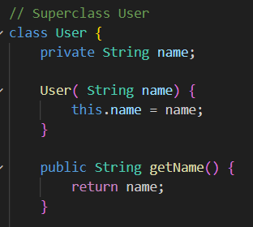

# Mini Project OOP - Library Management System

### Group Name: Michelin
1. [Lubna Al Haani Binti Radzuan](https://github.com/haani1224) (A23CS0107)
2. [Nur Firzana Binti Badrus Hisham](https://github.com/firzanabadrus) (A23CS0156)

### Project Description
This project implements a basic command-line-based Library Management System in Java. The system allows users to interact with a digital libraryand managing the books. It features two main user roles which is Admin and Member to interact with the library.
- Admin can add new books, view all books and view their own information.
- Member can view available books, borrow books using ISBN numbers and view their own information.
- The program makes use of object-oriented principles, including ArrayList, inheritance, polymorphism and exception handling to build a modular and maintainable system.

### UML Diagram

The UML class diagram illustrates a simple Library Management System in Java, which supports two types of users (Admin and Member) who interact with a Library to manage and borrow books.

- Arraylist: An arraylist of Book is declared inside library class.
- Association: Each book is associated with zero or one member (Association arrow).
- Composition: The library contains and manages multiple books (Composition arrow).
- Inheritance: Admin and Member are specializations of User (inheritance arrows).

### Implementation of Chapter 5 - ArrayList
ArrayList is implemented in the Library class. 
- ArrayList of Book class is declared in the Library class and initialized in the Library class constructor.

### Implementation of Chapter 6 - Association/Aggregation/Composition
#### Association
"Uses a" relationship.
In this project, User class and its child, is associated to the Library class because its receive a Library object and call its method.

In main:  
  
 

In Member class: 
  
In Admin class: 

#### Composition
"Has a" relationship with a strong ownership.
In this project, Book class is owned by the Library class since the lifetime of books are dependent on Library class. The Library class is responsible for creating and managing the lifecycle of Book objects. Book does not exist outside the context of the Library.

In Library class:  
 

### Implementation of Chapter 7 - Inheritance
Inheritance is an OOP mechanism where one class (subclass or child class) derives properties and behaviors from another class (superclass or parent class). It promotes code reusability and establishes an "is-a" relationship.

 

Inheritance allows Admin and Member to inherit common attributes and methods from the User superclass. This avoids code duplication and supports scalability.

 

- Both Admin and Member override the displayInfo() and displayPage() methods.
- Common attributes like name are defined in User.

### Implementation of Chapter 8 - Polymorphism
Polymorphism allows objects of different classes to be treated as objects of a common type (their superclass) and a single method call can perform different actions depending on the actual type of the object at runtime. This is often achieved through method overriding.

displayInfo()

 

displayPage()

 

- Both Admin and Member override the displayInfo() and displayPage() methods.
- Even if we call these methods using a User reference, the correct version is executed based on whether the object is an Admin or a Member.
  
### Implementation of Chapter 9 - Exception Handling
Exception handling is a robust way to manage runtime errors (exceptions) that disrupt the normal flow of a program. It allows to gracefully handle unexpected situations (like invalid input or a book not being found) instead of the program crashing. It uses try, catch, and throw keywords.

 
 

 

Exception handling is used to prevent the program from crashing due to invalid input (e.g., entering letters instead of numbers).
This is used in:
- The main menu
- Admin and Member menu selections
- ISBN entry for adding/borrowing books

This ensures a smooth user experience and input validation.

### Conclusion
This Library Management System project effectively demonstrates the practical application of core Object-Oriented Programming principles, including the use of `ArrayList` for dynamic data management, clear class relationships (association and composition), a robust inheritance hierarchy with polymorphism enabling flexible user interactions and comprehensive exception handling for error management, all integrated within an interactive, menu-driven interface to provide a solid foundation for a real-world Java application.
